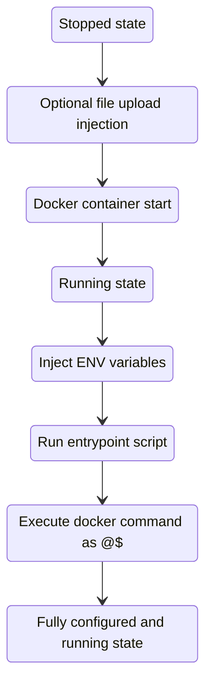

# Docker container module

Triton specific features in this module should cover the majority of Docker provisioning requirements.

## Supported module features

Some of the supported features:
  - container placement rules
  - ENV variable injection
  - file uploads
  - Docker command and entrypoiont customization
  - network port configuration
  - DNS service discovery
  - custom /etc/hosts entries

### Startup execution chain

The following initalization steps are effective at istance startup:



_Please note, file upload happens before the container starts._

### ENV variables

Each ENV variable specified via `var.env` is injected at startup time and is inherited
automatically by processes inside the running container.

### Entrypoint

Standard Docker entrypoint mechanism used for program execution inside a container.
Must have the executable bit set. To call multiple executables e.g. for Consul integration
[dumb-init](https://github.com/Yelp/dumb-init) process supervisor can be used.

### Command

Command is passed in to entrypoint as `$@`.

### File upload

File upload happens only once - at initial provisioning time and
the file is uploaded into a stopped container before it starts.

### Docker image

Docker image is pulled in from the specified docker registry. The registry must be accessible to
Triton's [IMGAPI](https://github.com/TritonDataCenter/sdc-imgapi)
component which is responsible for pulling the images in the background.

The docker image version can be specified with either docker_tag or docker_sha256.
If docker_sha256 is defined it will be used over docker_tag.

### Firewall

Firewall rules are managed transparently in the background. Each port specified via
`var.ports` directive will be automatically allowed in (ANY to PORT on this instance).

### Networks

The container is automatically attached to a network specified via `triton.network.public` label.
This label expects the Triton network name - can be checked with:

```
$ triton networks -o name
NAME
external
fabric-dev1
fabric-dev2
fabric-dev3
fabric-dev4
fabric-dev5
fabric-dev6
fabric_nat
```

### DNS discovery

DNS service names are assigned via `triton.cns.services` label. This requires a working
[TCNS](https://github.com/TritonDataCenter/triton-cns) setup for the given Triton user account.

### Affinity

Affinity rules can be set to via `com.docker.swarm.affinities` label.
This can guarantees instance placement on different physical compute nodes (CN).
Rule syntax is desribed in the [Placement](https://apidocs.tritondatacenter.com/docker/features/placement)
secion.

Some examples:

```
# Run on the same node as silent_bob:
docker run -e 'affinity:container==silent_bob' ...

# Same, using the label syntax:
docker run --label 'com.docker.swarm.affinities=["container==silent_bob"]' ...

# Run on a different node as all containers labelled with 'role=database':
docker run -e 'affinity:role!=database' ...

# Run on a different node to all containers with names starting with "foo":
docker run -e 'affinity:container!=foo*' ...

# Same, using a regular expression:
docker run -e 'affinity:container!=/^foo/' ...
```

### Custom /etc/hosts

Custom host enries can be defined with the following variable:
```
hosts = {
  host1 = {
    hostname = "example.com"
    ip_address = "127.0.0.1"
  },
  host2 = {
    hostname = "xyz.example.com"
    ip_address = "127.0.0.2"
  }
}
```

Given the following exists in variables.tf:

```
variable "hosts" {
  type = map(object({
    hostname = string
    ip_address = string
  }))
  default = null
}
```

And hosts is injected in main.tf:

```
hosts = var.hosts
```
