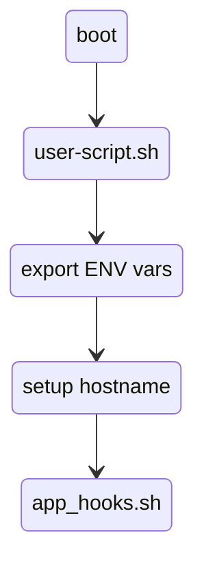

## Infrastructure module

Provisions Bhyve VMs, Linux and SmartOS bare-metal infrastructure conatiners.

Included Triton features and provisioning functions in this
module should cover the majority of use cases.

Assumptions:

  - strict instance affinity to spread across CNs
  - user-script triggers app-hooks to configure apps
  - ENV variable injection
  - metadata config injection

### Startup execution chain



### Notes on best practice

app-hooks.sh script should handle logic for app specific tasks
and account for reboot and startup scenarios. Some actions might need to run on every
startup, while others only at inital setup time.

### ENV variables

Expose one or more environment variables inside instances. This is expected
to be extracted via `mdata-get user_data` either via the user-script.sh or
app-hooks.sh or both.

### user-script.sh

Configures a startup script inside instances.
This script is executed on every instance boot.

This script should be only used for generic setup actions, for example:

  - timezone selection
  - hostname setup
  - resolv.conf handling

### app-hooks.sh script

Application or instance specific setup actions such as service startup logic or
app specific actions should be offloaded into this script.

This script is expected to be called from user-script.sh.

### Firewall

Firewall is turned on by default. Each instance provisioned will inherit a default
deny all firewall rule. Additional firewall rules are managed by the "firewall_rules" variable.

Each instance inherits a "firewall_id" tag which is unique for each instance group (instances provisioned
within the same job).
The ID is constructed and MD5 generated from the followig variables:

```
firewall_id = md5("${var.account}${var.role}${data.triton_image.image.version}${var.networks[0]}")
```

This guarantees a unique firewall ID string for each instance group version
in each environment, under each account.

Examples:

```
Instances cassandra0 cassandra1 cassandra2 in DEV1 environment will share the same
ID 'e43ab59503a0454323ab863202b9e427'.

Instances cassandra0 cassandra1 cassandra2 in DEV2 environment will share the same
ID '1a75a8001e11f8fcd1705534142bf0a7'. This ID will be different from DEV1 environment.

Instances nginx0 nginx1 nginx2 in DEV2 environment will share the same ID between
each other but this ID will differ from both cassandra clusters in DEV1 and DEV2.
```

_Note: the same firewall ID is reused for machine placement affinity rules (described below)._

### Networks

Network setup is handled trasparently for single/dual or multi NIC setup. Machines can be
attached to one or more networks at the same time. This is particularly useful for fabric
load-balancer scenarios.
For example HAProxy can be attached to both an "external" and a "fabric" network, serving as
the ingress load-balancer for the fabric network.

_Note: for fabric network deployments the fabric network must exist prior to executing this module._

### DNS discovery

DNS service names are assigned via "service_tags" variable. This requires a working
[TCNS](https://github.com/TritonDataCenter/triton-cns) setup for the Triton account.

### Affinity

Affinity rules are set to strict provisioning (operator '!=') for identical group of instances deployed in the same job.
This guarantees instance placement on different physical compute nodes (CN). Affinity rule is based on
the "firewall_id" tag and is identical for each application group deployed with a single Terraform job.
